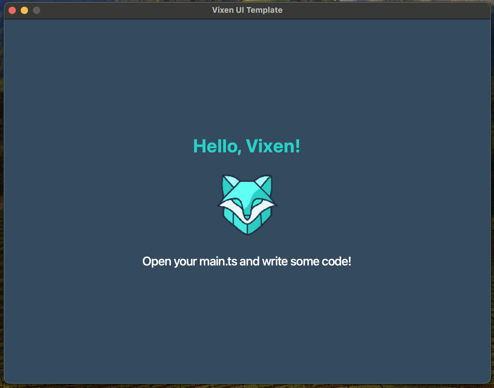

import { Code } from '@astrojs/starlight/components';

> How to use the Vixen UI to build a simple application

On this section you will learn how to use the Vixen UI to build a simple application using the `vanilla` template.

Vixen UI enables you to create desktop applications using Typescript and CSS like styling. You could see it as a lightweight and high performance desktop UI for Nodejs.

Vixen UI is also an efficient Javascript binding to the `Qt` Cpp library. Qt is one of the most mature and efficient UI library for building desktop applications. This enables Vixen to be extremely
efficiency memory and CPU compared with other popular UI Javascript Frameworks. The intention of this Sections is to show you how yo use the most common Vixen UI components to build a Hello world applcation.

## Choosing the right Code Editor

We might suggest you to use [VS Code](https://code.visualstudio.com/) as a main code editor for Vixen UI. if you like to have another alternatives, you can use [Sublime Text](https://www.sublimetext.com/) as a code editor.

## Hello World

To setup the basic project, run the following command:

```bash
pnpm create @vixen-js/vixen my-project --template vanilla
```

After the output, you can move into the `my-project` folder and run `pnpm i` to install the dependencies.
```bash
cd my-project
pnpm i
```

## Development

to start development you have to running the following command:
```bash
pnpm dev
```

When the command finish, you can see something similar to this:



Now you can open the `main.ts` file and check the source code.

export const mainTSContent = `import {
  QMainWindow,
  QWidget,
  QLabel,
  FlexLayout,
  QPixmap,
  AlignmentFlag,
  QIcon,
} from "@vixen-js/core";
import styles from "./styles/styles.css?raw";
import path from "path";

const images = path.resolve(__dirname, "./images");

const win = new QMainWindow();
win.setWindowTitle("Vixen UI Template");
win.setFixedWidth(800);
win.setFixedHeight(600);
win.setWindowIcon(new QIcon(\`\${images}/typescript.svg\`));

const root = new QWidget();
const flex = new FlexLayout();
root.setLayout(flex);
root.setObjectName("root");

const label = new QLabel();
label.setText("Hello, Vixen!");
label.setObjectName("label1");

const labelImage = new QLabel();
labelImage.setObjectName("image");
labelImage.setPixmap(new QPixmap(\`\${images}/Logo.png\`).scaled(100, 100));
labelImage.setAlignment(AlignmentFlag.AlignCenter);
labelImage.setFixedSize(100, 100);

const label2 = new QLabel();
label2.setObjectName("label2");
label2.setText("Open your main.ts and write some code!");

flex.addWidget(label);
flex.addWidget(labelImage);
flex.addWidget(label2);

win.setCentralWidget(root);
win.setStyleSheet(String(styles));
win.show();

globalThis.win = win;`;

<Code  code={mainTSContent} lang='ts' title="main.ts" />

Let's comment some code in the `main.ts` file:

- __QMainWindow__ is the root widget of all your application, it's the main Window.
- If you want to use  __FlexLayout__, you should import it from `@vixen-js/core`.
- If you want to add Some texts, you should import __QLabel__ from `@vixen-js/core`
- If you want to use images, you should import __QPixmap__ and add it into __QLabel__ to display it in the screen.
- If you want to use CSS styles, you should import your css file and set it in the `win.setStyleSheet(String(styles))` for Global Styles.

If you want to know more about the Vixen UI Components, you can check the Qt6 Component reference: https://doc.qt.io/qt-6/widget-classes.html
